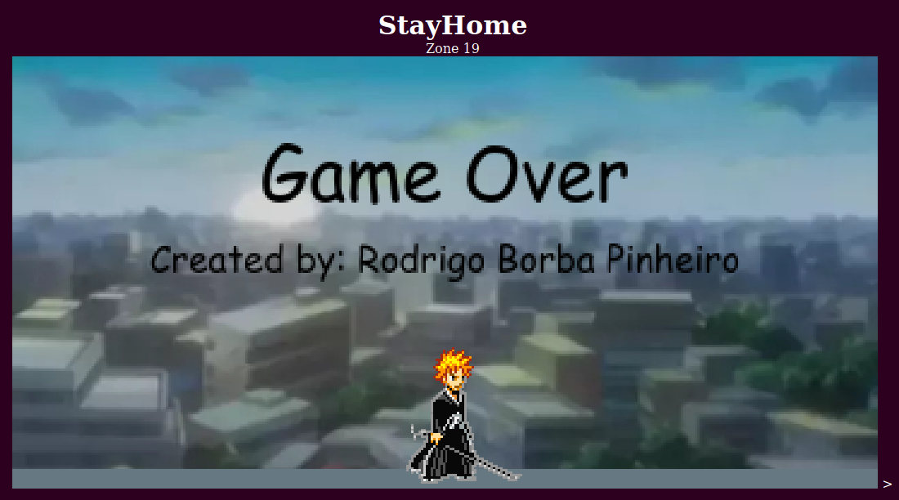

# #StayHome

### Description

Just a little project I decided to do while in quarantine and with my internship suspended for some days.
Learned a little bit of JavaScript and built a little platform "game";

### How to use:

#### On your own PC

You can clone the entire repository and just open the .html file in the your browser.
You may have problems:
  DOMException: "Permission denied to access property "document" on cross-origin object"
  SecurityError (files in the same folder are not considered to be from the same origin)

You can leverage this restriction by going to about:config url and then uncheck privacy.file_unique_origin boolean value.
Be careful when you do this!

The game uses the keyboard arrow keys to move around and jump.
When you reach an obstacle, jump over it.
When you find a door, press arrow down to use it.

#### Online

### Images used

The gif used to animate the main player was found here:
https://thumbs.gfycat.com/HairySecondaryGilamonster-size_restricted.gif

The images are from an anime called Bleach and were found online, specially in the Bleach Wiki website
https://bleach.fandom.com/fr/wiki/Bleach_Wiki

### Contact

Rodrigo Borba Pinheiro,  2020  
rodrigoborba1997@gmail.com  
Electronic Engineering - Signal and Image Processing  

This code is free to use, share and modify for any non-commercial purposes.

### Tutorial

If you're starting now, I strongly recommend you follow this tutorials:

The codes were written following the tutorials on youtube:
Some parts of the code were also adapted from the tutorial "Rabbit Trap"

https://pothonprogramming.github.io/

Special thanks to Frank Poth !
